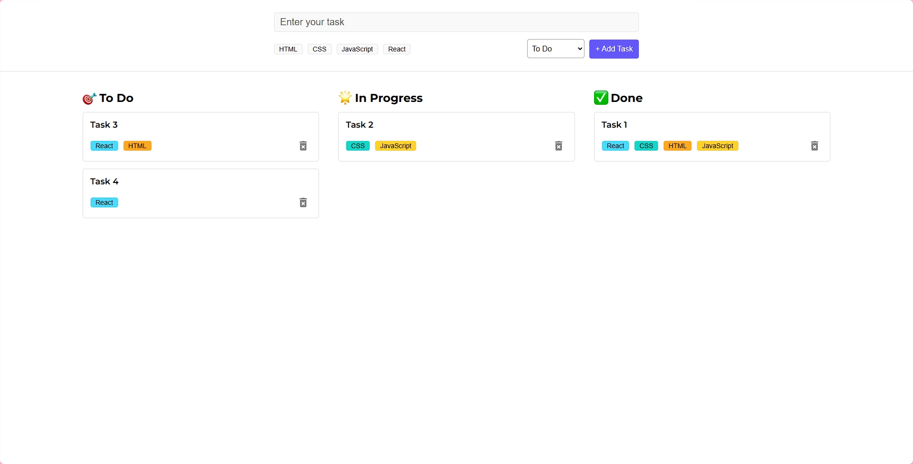

# To-Do-List Web Application

My first react project which is a simple To-Do-List web application , designed to efficiently manage and organize tasks.

Scope:

- Add & Remove Tasks
- Choose between tags

Limitation/s:

- Uneditable
- Title only, no description of tasks

## Preview

### Made with:

 
 
 
 

